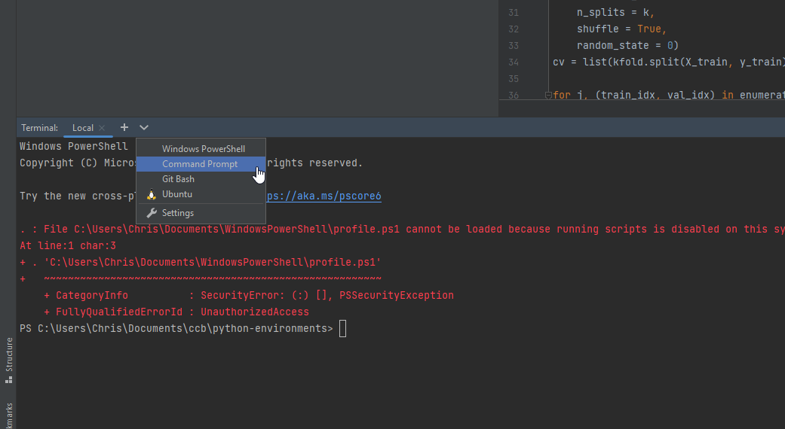

Feb 1, 2023 HMS Data Analysis Club
# Python and Python Environments 

## Diving Into Python

We'll start by going through [this notebook](https://colab.research.google.com/drive/1mrwoIPa1-tFYYjZP9TUNKMvIhovSeQ3L?usp=sharing) together. 
Collab notebook are an online Python notebook hosted by Google. 

## Installing Python Locally

There are a number of ways to install Python. 
You can directly install a Python distribution from the Python foundation. 
However, today we will instead be installing miniconda. 
Miniconda is based on Anaconda, a Python distribution which includes many popular scientific packages. 
However, it also takes up a lot of file space. 
Miniconda is a small, bootstrap version of Anaconda that includes only conda, Python, the packages they depend on, and a small number of other useful packages, including pip, zlib and a few others.
[You can download and install miniconda here](https://docs.conda.io/en/latest/miniconda.html).

## Installing an IDE 

We're going to use PyCharm as our developement environment for Python. You're welcome to use another (Visual Studio Cody, Spyder, Emacs, Vim, etc.) but we will be mainly supporting PyCharm. 
Make sure to select the **Community Version**. 
You can [download PyCharm here](https://www.jetbrains.com/pycharm/download). 

Once PyCharm is installed, you can use it to open the file `scripts/ml-workflow.py`. 
If PyCharm asks you to create a new project, select yes. 

Once inside PyCharm, open up the terminal. If you are on Windows, make sure to select the `command prompt` option under the `∨` menu:

This is a unix terminal emulator built into PyCharm, which should allow everyone to have the same command line interface. 

## Creating an environment

If you want to know some more about Conda and Python environments, [there's a great lesson here](https://edcarp.github.io/introduction-to-conda-for-data-scientists/01-getting-started-with-conda/index.html).
Generally, an environment is a separate installation of Python with its own set of packages. 
This allows a user to have multiple versions of Python and various packages around at the same time. 
Conda is a tool for managing Python environments which allows you to create, alter, export, and import environments. 

This is extremely useful for reproducable research. 
A researcher can export their Python environment using conda, which will then allow anyone trying to reproduce their work to ensure they have the exact same packages and versions installed.

Before we begin, we need to make sure conda has had a chance to initialize. 
In the terminal, run the command `conda init`. 
Now, we can create a new environment.
Let's call it `ml-env`, since we'll be using it to run a machine learning workflow. 
When creating an environment, we need to specify a name and we should specify which Python version we want to use. 

```
conda create --name ml-env python=3.10
```
It might take a few minutes to install, but we should have a new environment. 
We can see the current list of environments with:
```
conda env list
```
While we can see our new environment, there probably is a star next to the `base` environment. 
This indicates that we are still in `base`; we are not yet 'in' the ml-env environment. 
We need to use the `conda activate` command to enter ml-env.

```
conda activate ml-env
```
We should be able to list environments again and see that the star has changed. 
Additionally, `(ml-env)` should print at the start of each terminal line. 

Now that we are in our environment, we need to install the right packages into it. 
If we look at the `import` statements at the top of `ml-workflow.py`:

```python
import pandas as pd
from sklearn import model_selection, ensemble, metrics
import numpy as np
from matplotlib import pyplot as plt
import seaborn as sns
```
We can see the packages we want to use and should install into our newly created environment. 
Packages are installed using the `conda install` command. 
For instance, we install `pandas` with:
```
conda install pandas
```
Go through this for each of the imported packages. 
Note that the `sklearn` package, which is the most popular Python package for machine learning, is installed as `scikit-learn`. 
Finally, move into the `scripts` directory:
```
cd scripts
```
## Running the script

We should now be able to run our script.
This script performs classification, using telomere sequence data to predict which pathway cancer cells used to achieve replicative immortality.
The dataset is taken from [this paper](https://academic.oup.com/nar/article/46/10/4903/4990019?login=false) by Lee et al, 2018.
```
python ml-workflow.py
```
If everything worked, we should see some figures appear! 
